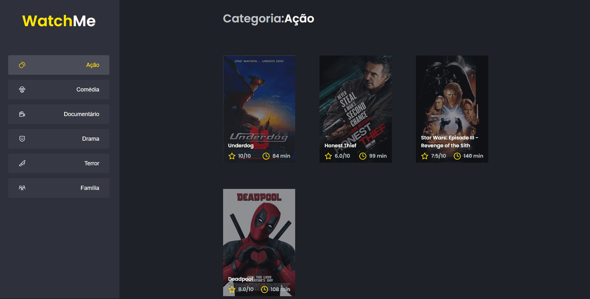
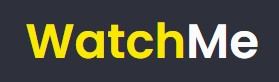

<h1 id="about">WatchMe - MoviePlataform</h1>

<p>📌 Este projeto tem o intuito de listar filmes e suas avaliações diretamente de uma FakeAPI<p>
<p>Desafio do bootcamp Ignite, com o intuito de praticar os conceitos de Componente no React</p>

<p align="center">
 <a href="#preview">Prévia</a> •
 <a href="#technologies">Tecnologias</a> •
 <a href="#installation">Como usar</a> 
</p>

<h2 align="left" id="preview">💻 Preview </h2>
<p>Clique na imagem abaixo e acesse uma prévia da aplicação diretamente na hospedagem da Vercel</p>
<a target="_blank" href="https://ignite-desafio-01-conceitos-do-react.vercel.app"></a>

<h2 align="left" id="technologies">📐 Tecnologias </h2>

As seguintes ferramentas foram usadas na construção do projeto:

- [React](https://pt-br.reactjs.org)
- [TypeScript](https://www.typescriptlang.org/)
- [Sass](https://sass-lang.com)


<h2 align="left" id="installation">🚀 Inicializando a aplicação</h2>

### Pré-requisitos

Antes de começar, você vai precisar ter instalado em sua máquina as seguintes ferramentas:
[Git](https://git-scm.com), [Node.js](https://nodejs.org/en/). 
Além disto é bom ter um editor para trabalhar com o código como [VSCode](https://code.visualstudio.com/)

### 🎲 Rodando o Front End

```bash

# Clone este repositório
$ git clone https://github.com/GabrielTurra/Ignite-02-Componentizando-a-Aplicacao

```
### 🌎 Com o repositório clonado, siga os seguintes passos:

```bash

# Acesse a pasta do projeto no terminal/cmd
$ cd Ignite-02-Componentizando-a-Aplicacao

# Inicia o servidor FakeAPI
$ yarn server

# Inicia a aplicação React
$ yarn dev

# O servidor inciará na porta:8080 - acesse http://localhost:8080

```
